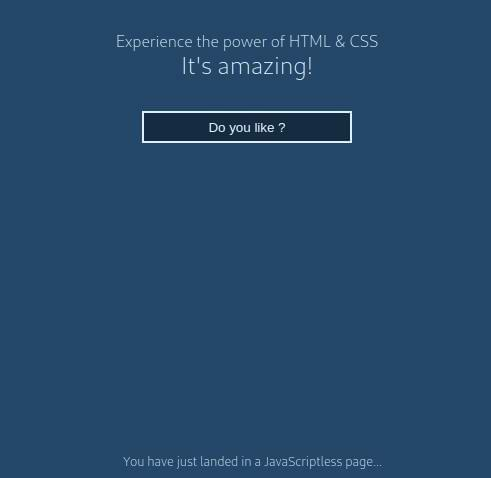

# Tutorial

```html
context( comment )
context( stack, new )
<body>
        background: hsla(var(--hue_color) 50% 28%/1);
        font-family: Cantarell Regular, system-ui, -apple-system, BlinkMacSystemFont, Segoe UI, Roboto, Oxygen, Ubuntu, Helvetica Neue, sans-serif;
        font-size: 16px;
        font-weight: 300;
  <main>
    context( stack, new )
    <p class="paragraph">
            context( block, centered )  /* block directive */
            margin: 2em 0;
            color: hsla(calc(var(--hue_color) - 50) 50% 94%/1);  /* TODO: 50 as a var */
      <i>
              font-style: normal;
              font-size: 150%;
      </i>
    </p class="paragraph"><!-- class closing -->
    context( url, select.context.html )
    <aside>
      <a>
            display: none;
      </a>
      <!-- variant -->
      <a:target>
              context( block, centered )  /* block directive */
              max-width: 50%;
              margin: 25vh auto;
              padding: 1rem;
              color: hsla(var(--hue_color) 50% 94%/1);
              font-size: 125%;
      </a>
    </aside>
    context( url, footer.context.html )
  </main>
</body>
```

This is the code of the main **Contextual-CSS** file used to generate this tutorial demo page modular stylesheets.
It is a mix of two different Web languages: HTML and CSS, spiced by a few function-like directives used by the **Contextual-CSS** script.


## Stack directives

The first line shows an HTML commented out `context` directive: it will be first removed by the script, before any processing of the file content, hence the directive will not be taken into account. Otherwise, all CSS comments, like the one on line 16 (`/* TODO: 50 as a var */`) would be left on the generated `.css` file.


There are four other `context` directives:
```
context( stack, ignore )
```
This directive is set to generate standalone selectors (selectors without the default **Contextual-CSS** parent-child relationship):
instead of generating a `html > body` selector, for instance, ignoring the processing stack will generate a simple `body` selector.<br/>
To cancel the effect of the __stack-ignore__ directive, a subsequent
```
context( stack, keep )
```
directive is necessary.


The __stack-new__ directive on line 11
```
context( stack, new )
```
resets the processing stack, therefore subsequent generated selectors won't have a `html > body >` prefix as it should be the case.<br/>
This directive is a way to control the nesting level of CSS selectors.


## Class definition

Line 10 shows a convenient way to generate a class selector:
```html
<p class="paragraph">
```
generates a simple `.paragraph` selector instead of a `p` selector as it is coupled with the reinitialization of the processing stack.<br/>
It is important to note that a
```html
</p class="paragraph">
```
is used to close the `paragraph` class tag: it is **mandatory** for the stack processing. The `<!-- class closing -->` comment is there to remind it.


## Universal and root selectors
The `<*>` tag, not defined in the HTML5 standard, is used to emulate the behavior of the universal CSS selector. It can be nested inside any tag (see line 15 in `html.context.html` file).

In the same way, the root selector tag can be set as a `<:root></:root>` pair. However it's better to put all root statements insi the html tag.


**This universal selector-tag should be avoid as much as possible because it goes against the direct parent-child relationship between the elements of the HTML structure enforced by Contextual-CSS**.


## HTML structure

**Contextual-CSS** is driven by the HTML structure of a page (or fragment). But a single HTML block can't express all the possible states of the contained tags. Therefore, it is sometimes necessary to duplicate a block to insert variations of the basic ruleset declarations.<br/>
For instance, in the `body.context.html` file, line 25, there is one variant (denoted by an HTML comment) of the basic `<a>` block:

```html
<aside>
  <a>
        display: none;
  </a>
  <!-- variant -->
  <a:target>
          context( block, centered )  /* block directive */
          max-width: 50%;
          margin: 25vh auto;
          padding: 1rem;
          color: hsla(var(--hue_color) 50% 94%/1);
          font-size: 125%;
  </a>
</aside>
```

In the HTML demo page, there is only one link inside the `<aside>` block, but to differentiate the selectors according to the `:target` state, the link tag `<a>` has to be replicated.<br/>
Of course, it is not necessary to repeat all the declarations shared by these variants and the basic block (indentation is used to make them outstanding).<br/>
Here the basic tag has only one declaration and the targeted tag has more declarations. But, apart the common `display` property, all other declarations could be moved to the basic tag. It is more meaningful to let the `display: none;` declaration in the basic tag to emphasize that it is not initially visible (see lower the _Hint_ question).


## Modular stylesheets

Organizing stylesheets in a modular way is always a good practice: this is the purpose of the `url` context functions on lines 19 and 34
```
context( url, select.context.html )
```
The URL argument (`select.context.html`) have no quotes and its path is __relative__ to the calling file path.<br/>
The stylesheet module generated imports the processing stack of its caller, but it can be **reset** or **ignored** as explained before, to yield a no-dependency CSS file (a component, for instance).


## Output

```css
body {
  background: hsla(var(--hue_color) 50% 28%/1);
  font-family: Cantarell Regular, system-ui, -apple-system, BlinkMacSystemFont, Segoe UI, Roboto, Oxygen, Ubuntu, Helvetica Neue, sans-serif;
  font-size: 16px;
  font-weight: 300;
}
.paragraph {
  display: grid;
  justify-items: center;
  margin: 2em 0;
  color: hsla(calc(var(--hue_color) - 50) 50% 94%/1);
}
.paragraph > i {
  font-style: normal;
  font-size: 150%;
}
aside > a {
  display: none;
}
aside > a:target {
  display: grid;
  justify-items: center;
  max-width: 50%;
  margin: 25vh auto;
  padding: 1rem;
  color: hsla(var(--hue_color) 50% 94%/1);
  font-size: 125%;
}
```

## Tutorial page



The `html.context.html` file has generated four stylesheets for the purpose of this tutorial page, but, in a real application, they would be merged in a single CSS file for performance concerns.<br/>
As you will discover loading that page in a browser, the **Contextual-CSS** generated code is not a simple decoration of the elements of the page but, without a single line of JavaScript, it shows or hides elements: have a look at the `select.context.html` file and its generated CSS file: HTML and CSS are awesome!

And JavaScript too, because `contextual_css.js` is a Node JS script.

**NB**: I hope that my _vertical coding style_ won't prevent you to review it: your comments are most welcome.

**Hint**: the three selecting options of the demo page trigger different behaviours. Have you found why?