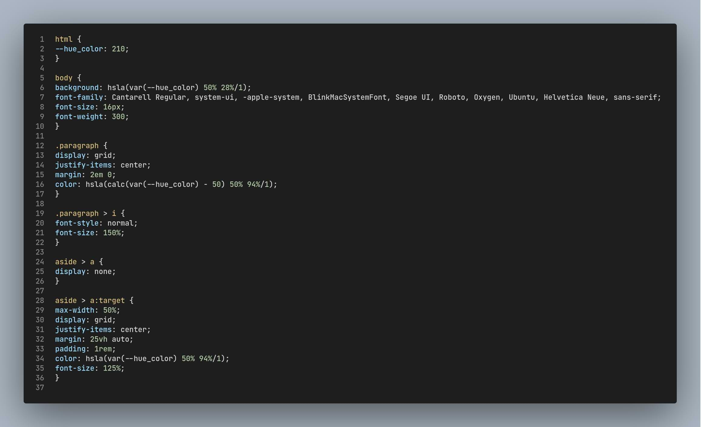

# Tutorial


This is the code of the main Contextual-CSS file used to generate the modular stylesheets used by the tutorial demo page.
It is a mix of two different markup languages: HTML, CSS, plus a few function-like directives used by the Contextual-CSS script.

## Stack directives

The first line show a commented out `context` directive, as an HTML comment: it will be first removed by the script, before any processing of the file content, hence the directive will not be taken into account. Otherwise, all CSS comments, like the one on line 16 (`/* TODO: 50 as a var */`) would be left on the generated `.css` file.


There are four other `context` directives:
```
context( stack, ignore )
```
The __stack-ignore__ directive is set to generate standalone selectors (selectors without the default Contextual-CSS parent-child relationship):
Instead of generating a `html > body` selector, for instance, ignoring the processing stack will generate a simple `body` selector.<br/>
To cancel the effect of the __stack-ignore__ directive, a subsequent
```
context( stack, keep )
```
directive is necessary.


The __stack-new__ directive on line 11
```
context( stack, new )
```
resets the processing stack, therefore subsequent generated selectors won't have a `html > body >` prefix has it should be the case.<br/>
This directive is a way to control the nesting level of CSS selectors.


## Class definition

Line 12 show a convenient way to generate a class selector:
```html
<p class="paragraph">
```
generates a simple `.paragraph` selector instead of a `p` selector as it is coupled with the reinitialization of the processing stack.<br/>
It is important to note that a
```html
</p class="paragraph">
```
is used to close the `paragraph` class tag: it is **mandatory** for the stack processing. The `<!-- closing tag -->` comment is there to remind it.

## Modular stylesheets

Organizing stylesheets in a modular way is always a good practice: this is the purpose of the `url` context functions on lines 22 and 37
```
context( url, select.context.html )
```
The URL argument (`select.context.html`) have no quotes and its path is __relative__ to the calling file path.<br/>
The stylesheet module generated imports the processing stack of its caller, but it can be **reset** or **ignored** as explained before, to yield a no-dependency CSS file (a component, for instance).

## Output



Have also a look at the `footer.context.html` output (`footer.css`) to see the result of line 1 directive:
```
context( minify, true )
```


## Tutorial page


The `html.context.html` file has generated three stylesheets for the purpose of this tutorial page, but, in a real application, they would be merged in a single CSS file for performance concerns.<br/>
As you will discover loading that page in a browser, the Contextual-CSS generated code is not a simple decoration of the elements of the page but, without a single line of JavaScript, it shows or hides elements: have a look at the `select.context.html` file and its generated CSS file: HTML and CSS are awesome!

And JavaScript too, because `contextual_css.js` is a Node JS script.

**NB**: I hope that my _vertical coding style_ won't prevent you to review it: your comments are most welcome.